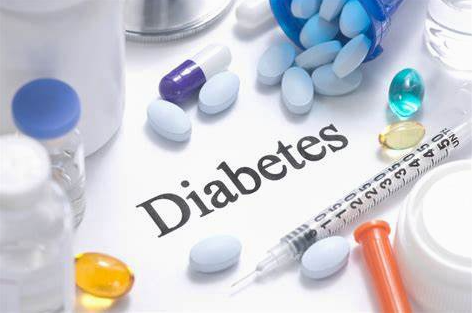

Did you know that diabetes affects how your body uses glucose? Glucose is a type of sugar and serves as the main source of energy for your body. After you eat, your body breaks down carbohydrates into glucose, which then enters your bloodstream. Your pancreas then releases insulin, a hormone that helps transport glucose from your bloodstream into cells for energy. 
However, people with diabetes may experience problems with insulin production or the way their body uses insulin. This can result in increased levels of glucose in the bloodstream, which is referred to as high blood sugar or hyperglycemia.

# Diabetes Predictions
The Diabetes Prediction Dataset is a collection of medical and demographic records of patients, which includes information about their diabetes status. It comprises essential features such as age, gender, body mass index (BMI), hypertension, heart disease, smoking history, HbA1c level, and blood glucose level. This dataset is highly useful for developing machine-learning models that can forecast the likelihood of diabetes in patients based on their medical history and demographic data. It assists healthcare professionals in identifying patients who are prone to diabetes and creating customized treatment plans. Additionally, researchers can use this dataset to explore the correlations between various medical and demographic factors and the risk of developing diabetes.

Source: Diabetes prediction dataset | Kaggle

[Diabetes_Predictions & Sagemaker Video](https://youtu.be/CMEEO23C8w0)
